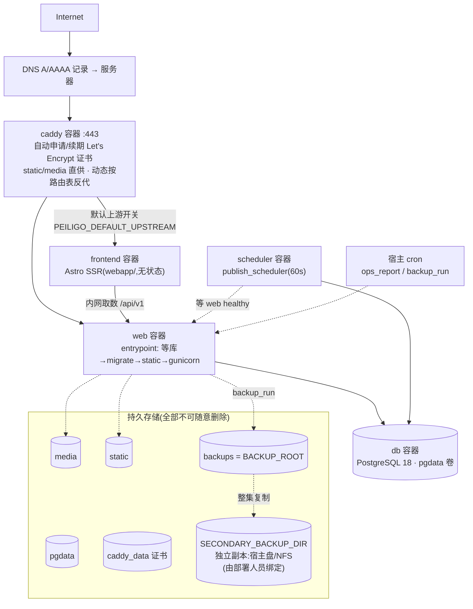

# Peiligo 服务器部署指南

> **这是 Deployment Guide(部署指南),不是 Deployment Record(部署记录)。**
>
> **截至本文基线(`main` @ `725f6d1`,2026-09-12 复核;初稿基线 `2992b1a`,2026-09-02),Peiligo 尚未在任何真实服务器上完成生产部署**:staging / production 部署、DNS、TLS 证书均**未执行**。生产同构的 Docker 编排已在**本地完整实跑验证通过**(2026-09-02,见 [../reviews/LOCAL_DOCKER_RUNTIME_VALIDATION.md](../reviews/LOCAL_DOCKER_RUNTIME_VALIDATION.md) 与 [LOCAL_RUN_AND_VALIDATION_GUIDE.md](LOCAL_RUN_AND_VALIDATION_GUIDE.md) 方式 B);其后 Phase 9 发布安全加固(公开页 CSP、HSTS、Secure Cookie、django-axes 防爆破、Wagtail 7.4.3 安全升级)已并入 main(2026-09-12,发布安全审查 PASS),本文已同步对齐(见 §6.1)。**本文定位:未来公网部署参考——本阶段未执行**;文中真实服务器操作步骤仍属**待执行**方案。
>
> 配套事实源:[../PRODUCTION_RUNBOOK.md](../PRODUCTION_RUNBOOK.md)(运维手册,本文与其口径一致)、[../FINAL_FULL_PROJECT_REVIEW.md](../FINAL_FULL_PROJECT_REVIEW.md)(终审与部署就绪判定)。

---

## 1. 适用目标环境(冻结架构)

| 项 | 口径 |
|---|---|
| 操作系统 | Linux(PVE 虚拟机或同等 Linux 服务器均可) |
| 编排 | Docker Compose(单机,`deploy/docker-compose.yml`) |
| 数据库 | PostgreSQL 18 容器(具名卷持久化) |
| 反向代理 / TLS | Caddy 2(自动 HTTPS,80/443) |
| 应用 | Gunicorn(镜像内),单 web 容器 + 单 scheduler 容器 |
| 持久存储 | PostgreSQL 卷、媒体卷、备份卷 + **独立备份副本存储** |

明确**不包含**(冻结口径):Redis、Celery、Elasticsearch、K8s、多机集群、SPA 构建链。

CPU / 内存 / 磁盘容量 / IP / 虚拟机编号**不在本文冻结**——按部署现场的规模评估决定(设计基线:部门 ≤30、正式内容 ≤10,000 条,见 [../NON_FUNCTIONAL_REQUIREMENTS.md](../NON_FUNCTIONAL_REQUIREMENTS.md) §8)。

## 2. 生产架构



## 3. 服务器前置条件

- Linux 服务器(可 SSH 登录——常规运维前提);
- **Docker Engine** 与 **Docker Compose plugin**(`docker compose version` 可用);
- **Git**;
- 防火墙/安全组放行 **80、443**(80 用于 Let's Encrypt HTTP-01 与跳转);
- **DNS 控制权**:能把域名 A/AAAA 记录指向本机;
- **持久磁盘**:数据库 + 媒体 + 备份的增长空间;若做独立副本,另需一块独立存储(外接盘/NFS);
- (可选)宿主 cron 或 systemd timer:跑备份与监控(见 §8、§10)。

## 4. 目录建议(推荐值,可调整)

```text
/opt/peiligo/            # 部署根(名字与位置按现场规范调整)
├── repo/                # git clone 的仓库(main 分支)
├── data/                # 宿主侧持久目录(如选择 bind mount 而非具名卷)
└── backup/              # 独立副本目标(或直接指向 NAS 挂载点)
```

**不要与代码中的容器路径混淆**:容器内固定使用 `/data/media`、`/data/static`、`/data/backups`(镜像与 Compose 已定义);宿主用哪个目录由你决定,经卷/挂载对应过去。

## 5. 取得与更新代码

首次:

```bash
cd /opt/peiligo
git clone <仓库地址> repo
cd repo
git checkout main
```

后续更新(一律快进,禁止改写历史):

```bash
git fetch origin
git pull --ff-only origin main
```

> ⚠️ **禁止把 `git reset --hard` 作为更新手段**,也禁止 force push(批次冻结口径)。工作区不干净时先查明原因,不要无脑重置。

## 6. 生产环境变量(`deploy/.env`)

样例文件:`deploy/.env.example`(哑值,可安全入库);真实 `.env` 在 `deploy/` 同目录创建,**不入 Git**。Compose 自动读取并经 `${VAR}` 插值注入容器。

| 变量 | 必填 | 用途 | 示例格式 | 敏感 |
|---|---|---|---|---|
| `POSTGRES_DB` | ✅ | 数据库容器初始化库名 | `peiligo` | 否 |
| `POSTGRES_USER` | ✅ | 数据库容器初始化用户 | `peiligo` | 否 |
| `POSTGRES_PASSWORD` | ✅ | 数据库口令(容器内拼 `DATABASE_URL`,勿手写) | 长随机串 | **是** |
| `SECRET_KEY` | ✅ | Django 签名密钥;`python -c "import secrets;print(secrets.token_urlsafe(64))"` 生成(≥50 位随机) | 长随机串 | **是** |
| `ALLOWED_HOSTS` | ✅ | Django 允许主机(逗号分隔) | `peiligo.example.edu` | 否 |
| `CSRF_TRUSTED_ORIGINS` | ◻️ | CSRF 可信来源(带 scheme);**同源部署可留空**(Caddy 同源反代,Django 4+ 隐式信任) | `https://peiligo.example.edu` | 否 |
| `WAGTAILADMIN_BASE_URL` | ✅(compose `:?` 强制) | 后台通知邮件等全 URL 基准;不带 `/admin` 与结尾斜杠;**与 DOMAIN 同源** | `https://peiligo.example.edu` | 否 |
| `DOMAIN` | ✅ | Caddy 站点主机名(自动证书的主体) | `peiligo.example.edu` | 否 |
| `FEEDBACK_EMAIL` | ◻️ | 反馈邮箱环境兜底(正式载体 = 后台「站点设置」,可后台改、即时生效) | `feedback@peiligo.example.edu` | 否 |
| `GUNICORN_WORKERS` | ◻️ | web 进程数,缺省 `2` | `2` | 否 |
| `SCHED_INTERVAL_SECONDS` | ◻️ | 定时发布调度间隔,缺省 `60` 秒 | `60` | 否 |
| `HSTS_SECONDS` | ◻️ | HSTS 时长;**首期建议 `3600` 观察期**,不设 = 一年终态 | `3600` | 否 |
| `BACKUP_ROOT` | ◻️ | 备份集根;**缺省落具名卷 `backups`**,仅要落到宿主目录/独立盘时设置(bind mount 自理) | `/srv/peiligo-backups` | 否 |
| `SECONDARY_BACKUP_DIR` | **强烈建议** | 备份独立副本目录;**必须指向另一块独立存储**(NFS/外接盘);不设 = 无独立副本,监控显式 WARN | `/mnt/backup-nas/peiligo` | 否 |
| `OPS_LOG_FILE` | ◻️ | 喂给 `ops_report` 的 JSON 日志文件路径(不设 = app_errors 信号如实报 unknown) | `/var/log/peiligo/app.json` | 否 |

> `backup_prune` 另支持 `--days` 参数(缺省 35 天,冻结下限 30);`BACKUP_RETENTION_DAYS` 环境变量**未被 compose 透传进容器**,在容器内调整保留期请直接用 `--days`。

**邮件姿势决策(部署时必须显式处理)**:当前镜像未配置 SMTP(`EMAIL_BACKEND` 未外置),后台「密码自助重置」邮件链路**不可用**;V1 账号恢复路径 = 总管理员后台改密 / 命令行。若要启用邮件,属新增配置工作,需先行决策(终审 V-2)。

### 6.1 已随代码固定的安全基线(Phase 9,2026-09-12 合入 main)

以下安全行为**不经环境变量开关**,已固化在 `src/peiligo/settings/production.py`、`src/peiligo/csp.py` 与 `deploy/` 工程文件中,部署时无法也不应用 env 改动它们:

| 项 | 现状 |
|---|---|
| DEBUG | 固定 `False` |
| Cookie | 会话 / CSRF Cookie 强制 `Secure` |
| 传输安全 | `SECURE_SSL_REDIRECT` + `SECURE_PROXY_SSL_HEADER`(Caddy 反代形态);`/healthz/`、`/readyz/` 豁免重定向 |
| HSTS | Django 侧由 `HSTS_SECONDS` 控制(首期建议 `3600` 观察期,无 preload;未来生产验收通过后回到缺省一年);Caddy 侧站点响应**另带** `max-age=31536000`(两路各出各的,不叠加) |
| CSP | 公开页面统一内容安全策略(脚本/样式仅本源);**`/admin/`、`/django-admin/` 豁免**(后台编辑器需要)——`src/peiligo/csp.py` |
| 登录防爆破 | django-axes:连续 10 次失败锁定 15 分钟(用户名+IP),保护 `/admin/` |
| 数据库暴露面 | PostgreSQL 仅容器网络内部可达(compose 仅 `caddy` 发布 80/443),不对外发布端口 |
| Caddy 响应头 | 全站点 `Strict-Transport-Security: max-age=31536000` 与 `X-Content-Type-Options: nosniff`(`deploy/Caddyfile`) |

技术细节见 [TECHNICAL_ARCHITECTURE_GUIDE.md](TECHNICAL_ARCHITECTURE_GUIDE.md) §11。

## 7. 首次部署(执行顺序)

```bash
cd /opt/peiligo/repo

# 1) 部署 .env
cd deploy && cp .env.example .env && vi .env   # 按 §6 逐项填写;HSTS 首期取 3600
cd ..

# 2) 校验编排与插值
docker compose --env-file deploy/.env -f deploy/docker-compose.yml config

# 3) 构建并启动( detached)
docker compose --env-file deploy/.env -f deploy/docker-compose.yml up -d --build

# 4) 观察(以下命令均带同样的 --env-file / -f 前缀,下文简写为 compose)
docker compose ... ps
docker compose ... logs -f web        # 等 entrypoint 完成: waiting db → migrate → static → gunicorn
```

**自动 vs 人工的边界**(不要重复做自动的事):

| 动作 | 谁做 |
|---|---|
| 等 DB 可达、`migrate --noinput`、铺 static、起 gunicorn | **entrypoint 自动**(幂等) |
| scheduler 启动 | 自动(web healthy 后) |
| Caddy 申请证书 | 自动(DNS 已指好 + 80/443 通,首次启动自动申请续期) |
| 五板块、权限骨架、账号、业务数据 | **人工**(见 §8) |
| 备份 cron / 监控 cron / 独立副本绑定 | **人工**(见 §8、§10) |

健康验证:

```bash
curl -f https://<域名>/healthz/     # {"status":"ok"} = 进程存活
curl -f https://<域名>/readyz/      # ok = 数据库可达
```

## 8. 初始业务设置

```bash
# 命令均在 web 容器内执行(下文 dcr = docker compose ... exec web)
alias dcr='docker compose --env-file deploy/.env -f deploy/docker-compose.yml exec web'

dcr python manage.py bootstrap_sections      # ① 五板块页(幂等,直接发布)
dcr python manage.py createsuperuser         # ② 技术/应急 superuser(R3 载体,仅故障恢复用)
# ③ R1 账号(非 superuser);stdin 重定向须加 -T(禁用 TTY 分配):
docker compose ... exec -T web python manage.py init_permissions \
      --admin-user <总管理员用户名> --password-stdin < 密码文件
```

之后在后台(`/admin/`,用总管理员账号登录。注意:命令行创建的账号**不触发**强制改密;总管理员在后台「设置/重置密码」后,对方登录时才会被强制先改密——这是设计行为,应急闸门为 `clear_password_must_change --username <账号>`):

1. 建部门 Snippet(「设置 → Snippets → 部门」);
2. 在对应板块页下建「部门容器」并绑定部门(仅为确有内容的部门建);
3. 为部门建岗位账号(命令行;stdin 重定向加 `-T`):`docker compose ... exec -T web python manage.py init_permissions --dept-user <用户名> --department <slug> --password-stdin < 密码文件`(每部门至多一个);
4. **验证部门隔离**:用 A 部门账号登录,确认看不到、进不去 B 部门的容器与内容;对内容执行删除会被系统拒绝(提示「永久删除仅限总管理员」——删除菜单项可能仍显示,但操作不会成功);确认动不了结构页;
5. 后台「站点设置」里填统一反馈邮箱(前台页脚即用);
6. 收尾:配置备份 cron(§9)、监控 cron(§10)、绑定独立副本存储。

## 9. 备份

| 项 | 冻结口径 |
|---|---|
| 频率 | **≥ 每 12 小时一备**,宿主 cron 驱动;**RPO ≤ 12h**(NFR 现行冻结口径,由 12 小时备份频率派生;PRD §15 原上限 24h) |
| 内容 | `db.dump`(pg_dump 自定义格式)+ `media.tar.gz` + `manifest.json` + `sha256sums.txt` |
| 位置 | 缺省 `backups` 具名卷(`BACKUP_ROOT` 可改指宿主/独立盘) |
| 独立副本 | `SECONDARY_BACKUP_DIR` 整集复制;**生产必须配置**(指向与主机故障域无关的独立存储),不配置监控会持续 WARN |
| 保留 | `backup_prune` 缺省 35 天(`--days` 可调,**下限 30**);先 dry-run 后 `--apply`;只删双判据备份集 |
| 失败 | 清残集 + 非零退出 + 结构化日志 `backup.run status=failed`;永不回显数据库口令 |

宿主 cron 示例(注意 `-T` 与日志落盘):

```cron
# /etc/cron.d/peiligo-backup —— cron.d 格式第 6 列是用户名(此处 root),
# 写入 root 自己的 crontab(crontab -e)则免用户字段。cron 的工作目录是 /,
# --env-file 必须用绝对路径(相对路径 deploy/.env 会静默失效)。
17 */12 * * * root docker compose --env-file /opt/peiligo/repo/deploy/.env -f /opt/peiligo/repo/deploy/docker-compose.yml \
    exec -T web python manage.py backup_run >> /var/log/peiligo-backup.log 2>&1
# 每周清理(先观察 dry-run 输出一段时间再上 --apply)
23 4 * * 1 root docker compose --env-file /opt/peiligo/repo/deploy/.env -f /opt/peiligo/repo/deploy/docker-compose.yml \
    exec -T web python manage.py backup_prune --apply >> /var/log/peiligo-backup.log 2>&1
```

手工执行:`docker compose ... exec web python manage.py backup_run`。

> **注意**:`SECONDARY_BACKUP_DIR` 若指向宿主路径,须由部署人员在 Compose 里为 web 服务补一条 bind mount(样例文件未预置该挂载)——这是「独立副本」真正独立的物理前提,属部署现场决定项。

## 10. 恢复(Restore)

**铁律:不要在第一次真实灾难时才第一次跑 restore。** 恢复演练是上线前置项(季度一练,RTO ≤ 4h)。`backup_restore` 设计上**绝不默认覆盖现库**:不给显式目标参数 = 拒绝执行;目标库与当前库同名、媒体目标等于/位于当前 `MEDIA_ROOT` 内 = 拒绝。

演练/灾备统一流程(先隔离目标,验证后再谈切换):

```bash
# 1) 选一套备份集并核对校验和
ls <BACKUP_ROOT>/
sha256sum -c <BACKUP_ROOT>/<集>/sha256sums.txt   # 在备份集目录语境复核

# 2) dry-run:只校验(manifest / 校验和 / pg_restore 目录 / tar 可读),不写任何数据
dcr python manage.py backup_restore --source <BACKUP_ROOT>/<集> --dry-run

# 3) 建隔离目标:独立库建在 db 容器内(createdb 是 db 容器里的命令,web 容器没有)
docker compose ... exec db sh -c 'createdb -U "$POSTGRES_USER" peiligo_restore_drill'
#    媒体目录无需宿主 mkdir:恢复在 web 容器内执行,产物自建于容器内 /tmp/drill-media。
#    演练后如需在宿主抽查媒体:docker compose ... cp web:/tmp/drill-media ./drill-media

# 4) 实际恢复到隔离目标
dcr python manage.py backup_restore --source <BACKUP_ROOT>/<集> \
    --target-database peiligo_restore_drill --media-target-dir /tmp/drill-media

# 5) 起临时实例指向隔离库抽查数据;记录全程耗时,验证 RTO ≤ 4h
```

真实灾难切换 = 同一命令换显式目标,由人工决定并执行;**数据库恢复属高风险操作,任何第一次变体都应先在隔离环境走通**。

## 11. 监控

无监控平台、无常驻守护,全部接在一条命令上:

```bash
dcr python manage.py ops_report     # 输出 JSON;存在 CRIT 时非零退出
```

| 信号 | WARN | CRIT |
|---|---|---|
| `database` | — | 连不上 |
| `disk`(媒体/备份/静态所在盘) | 剩余 <20% | <10% |
| `backup_freshness` | >12h | >24h / 无备份 / 副本已配置但为空 |
| `backup_heartbeat` | — | 最近备份失败 |
| `publish_scheduled` 心跳 | >15 分钟 | >2 小时 / 从未跑 / 失败 |
| `login_anomalies`(近 24h axes) | 有锁定 | —(业务信号) |
| `app_errors`(需 `OPS_LOG_FILE`) | 24h ERROR>0 | —(未配置报 unknown) |

接线方式(任选,不强制 Prometheus/Grafana):

```cron
# /etc/cron.d/peiligo-ops(每 5 分钟;告警 = 退出码非零,或解析 JSON overall != ok)
*/5 * * * * root docker compose --env-file /opt/peiligo/repo/deploy/.env -f /opt/peiligo/repo/deploy/docker-compose.yml \
    exec -T web python manage.py ops_report >> /var/log/peiligo-ops.json 2>&1
```

systemd timer、或任何能定时执行命令并消费退出码的第三方拨测,同样可用。`/healthz/`(存活)与 `/readyz/`(就绪)也可直接用于外部拨测。

## 12. 日志

全部服务日志 = 单行 JSON 入 stdout,查看:

```bash
docker compose ... logs web        # 应用与请求异常(django.request 独立成行)
docker compose ... logs scheduler  # publish_scheduled.run / scheduler_error
docker compose ... logs caddy      # 访问日志与证书
docker compose ... logs db         # PostgreSQL
```

- 保留期由运行环境采集侧负责(工程默认 ≥30 天,与备份保留对齐);`OPS_LOG_FILE` 可把 JSON 落成文件供 `app_errors` 信号用;
- **敏感信息边界**:日志不含密码/密钥/Token/env 值;备份命令永不回显数据库口令;`/readyz/` 失败只说 unavailable 不带异常细节;治理审计在 DB(`/admin/gov-audit/`)不在日志。

## 13. 更新流程(安全顺序)

```bash
cd /opt/peiligo/repo

# 1) 先备份
docker compose ... exec web python manage.py backup_run

# 2) 快进代码(禁止 reset --hard)
git fetch origin && git pull --ff-only origin main

# 3) 重建并滚动(迁移由 entrypoint 自动执行,幂等)
docker compose --env-file deploy/.env -f deploy/docker-compose.yml up -d --build

# 4) 验证
curl -f https://<域名>/healthz/ && curl -f https://<域名>/readyz/
docker compose ... ps             # db / web healthy(仅这两者配了 healthcheck);scheduler 已随 web healthy 重启
# 冒烟:首页 / 五板块 / 搜索 / 后台登录 / 一篇内容的发布与归档

# 5) 持续观察
docker compose ... logs -f web    # 或等待下一轮 ops_report
```

已知残留(终审 L-3):entrypoint 向 static 卷**只增不删**——多次升级后旧哈希静态文件会累积。静态文件可由镜像完全重建:低峰期停 web → 清空 static 卷内容 → 重新 `up`,entrypoint 会铺回当前版本(操作前无需备份,但建议记下执行时间)。

## 14. 回滚

**三种「回滚」不是一回事:**

| 类型 | 做法 | 风险 |
|---|---|---|
| **前端切换回退**(SPEC-001) | deploy/.env 把 `PEILIGO_DEFAULT_UPSTREAM` 改回 `web:8000` → `compose up -d --force-recreate caddy`;只动 caddy 容器,秒级;详见 [../PRODUCTION_RUNBOOK.md](../PRODUCTION_RUNBOOK.md) §12 | 低;web/db/frontend 零接触 |
| **代码回滚** | 用上一发布提交重新构建并 `up -d --build`(该提交当时也应走同流程) | 低;entrypoint 幂等 |
| **数据库 migration 回滚** | **没有自动回滚**。代码回滚不会(也不应)自动降 schema;若新迁移必须撤销,按 Django `migrate <app> <旧号>` 个案处理并先在隔离库验证 | 中;须逐案评估 |
| **数据回滚(restore)** | 走 §10 隔离恢复流程,**不是**代码回滚的替代品;当前库被新代码写过之后直接覆盖恢复会丢数据 | **高**;永远先隔离演练,优先 staging 验证 |

禁止事项(冻结口径):`git reset --hard` / force push / 对真实生产库直接 restore。

## 15. 生产验收清单(Checklist)

部署完成后逐项勾选。**最后四类属未来验证项,不阻塞上线判定,但必须排期**(见 §16):

- [ ] `main` 工作区干净,HEAD = 预期发布提交
- [ ] `docker compose config` 校验通过
- [ ] 四容器全部 running;db / web 显示 healthy(仅这两者配置了 healthcheck)
- [ ] HTTPS 证书有效(DNS 已指、Caddy 已签)
- [ ] `/healthz/` 200
- [ ] `/readyz/` 200
- [ ] `/admin/` 登录正常(总管理员账号;强制改密动线经后台重置密码路径另行抽查)
- [ ] 五板块就位(`/chronicle/` `/events/` `/materials/` `/software/` `/guide/`)
- [ ] 搜索可用(关键词 + 筛选 + 过期内容标注)
- [ ] 上传可用(文档/图片,超限与非法类型被拒)
- [ ] 外链确认页正常(外链不裸跳)
- [ ] 公开页面响应带 `Content-Security-Policy` 头(`/admin/` 豁免;Phase 9 安全基线,见 §6.1)
- [ ] 部门权限隔离验证通过(A 部门不可见/不可改 B 部门;部门无删除权)
- [ ] scheduler 心跳更新(`ops_report` 的 publish_scheduled = ok)
- [ ] `backup_run` 成功且 `ops_report` 的 backup_freshness = ok
- [ ] `SECONDARY_BACKUP_DIR` 独立副本生成(独立存储上可见备份集)
- [ ] `ops_report` 接入 cron 且退出码告警链路可用
- [ ] **恢复演练**完成(隔离 restore + RTO 实测,见 §10)
- [ ] **监控值守**到位(ops/backup cron 运行中)
- [ ] **性能验证**完成(FCP ≤2s、千条搜索亚秒、100 并发——未来验证)
- [ ] **无障碍验证**完成(WCAG 2.2 AA 正式走查——未来验证)

## 16. 当前部署状态(逐级,截至 2026-09-12)

| 层级 | 状态 |
|---|---|
| 生产工程(Dockerfile / Compose / Caddyfile / entrypoint / .env.example) | **IMPLEMENTED**(实现完毕) |
| 静态校验(`docker compose config` 等) | **COMPLETED**(通过) |
| 本地 Docker 运行时实跑验证 | **COMPLETED / PASS**(2026-09-02,含备份与恢复演练;证据见 [../reviews/LOCAL_DOCKER_RUNTIME_VALIDATION.md](../reviews/LOCAL_DOCKER_RUNTIME_VALIDATION.md),复现步骤见 [LOCAL_RUN_AND_VALIDATION_GUIDE.md](LOCAL_RUN_AND_VALIDATION_GUIDE.md) 方式 B) |
| 发布安全审查(Phase 9 Release Security Gate) | **PASS**(2026-09-12,`main` @ `725f6d1`:公开页 CSP、HSTS、Secure Cookie、django-axes、Wagtail 7.4.2 → 7.4.3 安全升级) |
| Staging 部署 | **NOT YET PERFORMED** |
| Production 部署 | **NOT YET PERFORMED** |
| DNS / TLS(真实域名与证书) | **NOT YET PERFORMED**(Caddy 自动证书能力已就绪,未对接) |
| 性能 / WCAG / 恢复演练 | **VALIDATION REQUIRED**(恢复机制已在本地验证过一轮,正式环境按季度演练;性能与 WCAG 未执行) |

**不要让任何后来者误以为服务器已经配置好了。** 接手顺序建议:staging(可用真域名低配 VM)→ 生产;每步完成后回到本文 §15 验收清单逐项打勾。
