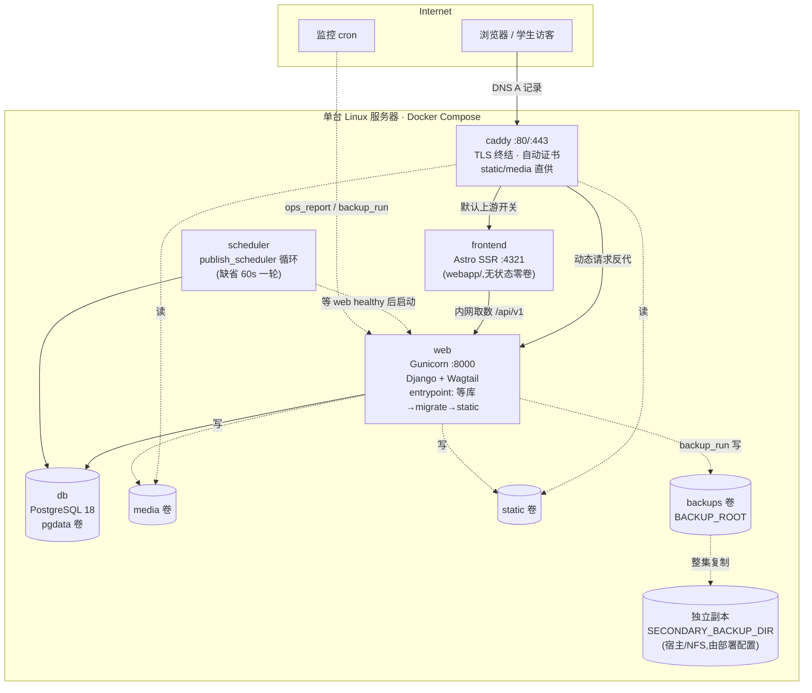

# Peiligo 技术架构指南

写给**全栈工程师、未来维护者、项目老师**。这里只讲「系统是怎么搭起来的、为什么这样搭」;操作步骤见 [LOCAL_RUN_AND_VALIDATION_GUIDE.md](LOCAL_RUN_AND_VALIDATION_GUIDE.md) 与 [SERVER_DEPLOYMENT_GUIDE.md](SERVER_DEPLOYMENT_GUIDE.md);正式决策原文见 [../adr/](../adr/README.md)。

> **基线**:`main` 分支(初稿 2026-09-02,HEAD `2992b1a`;2026-09-12 对照 `main` @ `725f6d1` 复核更新——首页轮播、Wagtail 7.4.3 安全升级与 Phase 9 发布安全加固已并入)。文中版本号、命令、变量名均逐字核对自当前代码。
>
> **状态声明**:下文「生产架构」已在本地以 Production-like 方式**完整实跑验证通过**(2026-09-02,四容器构建、启动、健康检查、内容发布、定时发布、备份与恢复,证据见 [../reviews/LOCAL_DOCKER_RUNTIME_VALIDATION.md](../reviews/LOCAL_DOCKER_RUNTIME_VALIDATION.md));但**尚未在真实服务器上部署过**——正式域名/TLS/DNS、生产密钥、性能与无障碍正式验证均属部署阶段工作。

---

## 1. 技术栈

| 层 | 选型 | 版本(逐字取自 requirements*.txt / pyproject.toml) |
|---|---|---|
| 语言 | Python | 3.13(`requires-python = ">=3.13,<3.14"`) |
| Web 框架 | Django | 5.2.17(LTS) |
| CMS | Wagtail | 7.4.3(LTS;2026-09 由 7.4.2 安全升级,覆盖 5 项上游安全公告,见 requirements.txt 注) |
| 数据库 | PostgreSQL | 18(`postgres:18` 镜像;驱动 psycopg 3.3.4) |
| 模板 | Django Templates(服务器端渲染) | 无 SPA、无 Node 构建链 |
| 应用服务器 | Gunicorn | 26.1.0(WSGI) |
| 反向代理 / TLS | Caddy | `caddy:2`(自动 HTTPS) |
| 编排 | Docker Compose | 单机四服务(无 Redis/Celery/Elasticsearch/K8s) |
| 登录限速 | django-axes | 8.3.1(DB 存储,无 Redis 依赖) |
| 数据库连接 | dj-database-url | 3.0.1(`DATABASE_URL` 解析) |
| 上传内容签名 | filetype | 1.2.0(魔数识别) |
| 图像处理 | Pillow 12.3 / pillow_heif 1.5 / Willow 1.12 | Wagtail images 依赖 |
| 测试 | pytest 9.1.1 + pytest-django 4.14.0 | 54 个测试文件 |
| Lint / 格式 | ruff 0.16.3 | `ruff check` + `ruff format` |
| 依赖审计 | pip-audit 2.10.1 | dev 依赖 |
| CI | GitHub Actions | 双 job 质量门（后端＋前端，见本指南 CI 节） |

版本组合由 [ADR-0001](../adr/0001-wagtail-django-python-versions.md) 冻结(Wagtail 7.4.x LTS + Django 5.2 LTS + Python 3.13)。

## 2. 生产架构(目标形态)



**这是生产目标架构:已在本地同构实跑验证,但尚未部署到真实服务器。** 冻结口径:Linux/PVE 虚拟机(或同等 Linux 服务器)+ Docker Compose + PostgreSQL 容器 + Caddy;明确**不含** Redis、Celery、Elasticsearch、SPA、K8s([../PRODUCTION_RUNBOOK.md](../PRODUCTION_RUNBOOK.md) 头注)。

### 请求路径(Caddy 路由,`deploy/Caddyfile`;SPEC-001 起沿用 ADR-0009 路由表形状)

- `{$DOMAIN}` 站点主机块;`encode gzip`;响应带 `Strict-Transport-Security: max-age=31536000`(与 Django 侧 HSTS 各出各的,不叠加);
- `/healthz*` → 反代 web(基础设施探针,不随前端开关翻转);
- `/static/*`、`/media/*` → Caddy 直接读卷供文件(web 只出动态);
- `/api/v1/*` → 恒 404(API 仅经 Compose 内网供 Astro SSR 取数,不公开路由,ADR-0008 §S1);
- `/django-admin/`、`/admin/`、`/documents/`、`/link-confirm/go/` → 反代 web(管理面/文档/外链出口,恒指 web);
- **其余全部 → 默认上游 `PEILIGO_DEFAULT_UPSTREAM`(唯一开关)**:缺省 `web:8000`＝v1 整站回根(部署后公开面零变化);置 `frontend:4321`＝新 Astro 前端回根。翻转仅重建 caddy 容器(秒级),切换/回滚 runbook 见 [../PRODUCTION_RUNBOOK.md](../PRODUCTION_RUNBOOK.md) §12;
- Caddy 管理接口仅绑定 `localhost:2019`;访问日志走 stdout。

## 3. Django 与 Wagtail 的分工

- **Django** 提供:ORM、认证(`django.contrib.auth`)、会话、中间件链、模板引擎、staticfiles、admin(`django-admin/`);
- **Wagtail** 提供:页面树与路由、后台(`/admin/`)、修订/预览/发布/定时(`Revision.approved_go_live_at`)、图片文档库、Snippet、权限(`GroupPagePermission`/`GroupCollectionPermission`)、搜索框架;
- **Peiligo 自身**只写「校园业务」:五个板块的内容模型、部门容器与权限初始化、生命周期推导、搜索过滤层、上传/外链校验、备份监控工具。**不修改 Wagtail 核心**是全项目红线(官方扩展点全覆盖,上游升级零阻力的前提)。

项目配置包在 `src/peiligo/`(pip editable 安装),业务 app 在仓库根(与 `manage.py` 同级)——与官方 `wagtail start` 骨架同构([ADR-0003](../adr/0003-clean-wagtail-skeleton.md))。

## 4. 仓库结构

```
├── manage.py                  # 缺省 DJANGO_SETTINGS_MODULE = peiligo.settings.dev
├── pyproject.toml             # 包定义 + pytest/ruff 配置
├── requirements.txt           # 运行依赖(钉版)
├── requirements-dev.txt       # + pytest / ruff / pip-audit
├── .env.example               # 本地开发环境变量样例(哑值)
├── home/                      # 首页、板块页、SiteSettings、FeaturedItem、CarouselItem、healthz/readyz
├── notices/                   # 通知页、文章页、活动字段、生命周期状态机(lifecycle.py)
├── departments/               # Department Snippet、部门容器页、权限初始化命令
├── resources/                 # 学习资料页、软件与工具页、学科/类型/平台词表
├── guides/                    # 校园指南页、指南类别
├── search/                    # 全站搜索视图、过滤服务、E1 搜索后端
├── frontend/                  # 预留空壳 app(当前无模型无代码)
├── api/                       # 只读 Headless API(E1–E9,零模型零迁移,ADR-0008)
├── templates/                 # 全站模板(含 404/500、robots.txt、后台覆盖)
├── webapp/                    # 新前端(Astro SSR;SPEC-001 验收集成,见 webapp/docs/)
│                              # npm 脚本:dev/build/check/test/e2e/lint
├── static/                    # 纯 CSS/JS 源(collectstatic 直收,无构建链)
├── locale/zh_Hans/            # 后台中文补译覆盖(LOCALE_PATHS)
├── src/peiligo/               # 项目配置包 + 可复用微模块
│   ├── settings/              # base.py / dev.py / production.py
│   ├── applog/                # 结构化日志信号 + publish_scheduler / run_publish_scheduled
│   ├── backupkit/             # backup_run / backup_prune / backup_restore
│   ├── opsignal/              # OpsHeartbeat 心跳表 + ops_report
│   ├── passwordgate/          # 强制改密闸门(PasswordState + 中间件)
│   ├── govaudit/              # 用户/组治理 DB 级审计(复用 Wagtail log_actions)
│   ├── upload_validation.py   # 上传三级一致性校验
│   ├── link_validation.py     # 外链校验与展示规范化
│   ├── seo.py / logging_utils.py / context_processors.py
│   └── urls.py / wsgi.py
├── deploy/                    # Dockerfile / docker-compose.yml / Caddyfile /
│                              # docker-entrypoint.sh / .env.example
├── tests/                     # pytest 套件(54 个测试文件)
├── docs/                      # 正式文档(含 adr/ 与本 guides/)
└── .github/workflows/ci.yml   # CI 质量门
```

## 5. 页面树(信息架构的骨架)

站点根(Wagtail Root,不计数)之下固定四层:

```
Root
└── HomePage(全站唯一)
    └── SectionPage × 5(校园纪事 / 校园活动 / 学习资料 / 软件与工具 / 校园指南)
        └── DepartmentContainerPage(部门容器,按需创建)
            └── 内容页(仅五种类型,见下表)
```

| 模型 | 层 | 约束(逐条来自模型声明) |
|---|---|---|
| `HomePage` | 1 | `parent_page_types` 仅站点根;`subpage_types` 仅 `SectionPage` |
| `SectionPage` | 2 | 每板块一页、全站唯一;`subpage_types` 仅 `DepartmentContainerPage` |
| `DepartmentContainerPage` | 3 | 仅挂板块页下、不嵌套;`department` 外键必填(PROTECT);同板块同部门唯一;`subpage_types` 为五类内容页 |
| `NoticePage` | 4 | 仅 chronicle/events 板块;`expire_at` **必填且须未来**;可挂活动字段 |
| `ArticlePage` | 4 | 仅 chronicle/events;`expire_at` 可空,填则须未来;可挂活动字段 |
| `MaterialPage` | 4 | 仅 materials;`expire_at` 强制为空(常青内容) |
| `SoftwareToolPage` | 4 | 仅 software;`expire_at` 强制为空;外链下载,不托管安装包 |
| `GuidePage` | 4 | 仅 guide;`expire_at` 强制为空;固定字段结构,无富文本 StreamField |

内容归属哪个板块**没有存储字段**,由树位置推导(内容页 → 容器 → 板块页 slug 对照 `home.models.SECTIONS` 冻结清单)。

**DepartmentContainerPage 为什么存在却不对外?** 它是**权限挂载点 + 路由分组**,不是内容页([ADR-0004](../adr/0004-department-permission-container-tree.md)):部门权限挂在容器上自动向子树传播;但前台访问容器 URL 一律 404(`serve` 抛 `Http404`)、不进导航、不进 sitemap(`get_sitemap_urls` 返回空)、不进搜索索引(`search_fields = []`)。PRD 原则:「板块描述『信息是什么』,部门字段描述『谁发布』;任何部门均不建立独立主页」([../INFORMATION_ARCHITECTURE.md](../INFORMATION_ARCHITECTURE.md) §3)。

## 6. Page / Snippet / Site Settings 的分工

| 载体 | 适合什么 | 本项目实例 |
|---|---|---|
| **Page** | 有 URL、有生命周期、要出现在前台/搜索的正式内容 | 五类内容页 + 三种结构页 |
| **Snippet** | 复用的受控数据(编辑用,无独立 URL) | `Department`(部门:权限锚点、URL 部门段、筛选维度)、`Discipline`(学科)、`MaterialType`(资料类型)、`GuideCategory`(指南类别)、`Platform`(适用平台,软件工具 M2M)、`Tag`(受控标签,仅总管理员可建)、`FeaturedItem`(首页推荐位:所指页面 + 起止时间 + 启用开关;前台不再单独成块,作为首页「校园快讯」的第一优先来源)、`CarouselItem`(首页轮播项:站内内容页 XOR 经确认跳转页的外链,≤5 条) |
| **Site Settings** | 全站单例运营配置 | `SiteSettings`:`alert_text`/`alert_start_at`/`alert_end_at`(首页紧急提示,起止成对且止 ≥ 起)、`feedback_email`(统一反馈邮箱)、`redirect_notice_text`(外链确认页声明,空=只渲染结构化四要素)。编辑权收归总管理员 |

例子:一篇「图书馆期末开放安排」是 `NoticePage`(挂在图书馆部门的容器下、归属校园纪事板块、`expire_at` 设为学期末);「图书馆」本身是 `Department` Snippet;「首页是否挂紧急提示」在 `SiteSettings` 里改。

## 7. 权限架构

**原则:不自研第二套 RBAC。** [../ROLE_PERMISSION_MATRIX.md](../ROLE_PERMISSION_MATRIX.md) 冻结了实现方向:Django Group + Wagtail 页面树权限 + 自带认证;明文禁止自建 RBAC 表、JWT/自定义令牌、自定义账号表、Session 存部门 ID 判权、自写权限中间件。

| 角色 | 载体 | 权限要点 |
|---|---|---|
| **R1 总管理员**(仅一名) | 「总管理员组」 | 根级 `GroupPagePermission`(add/change/publish)+ 全量模型权限(含 `bulk_delete_page`)+ 根集合 `GroupCollectionPermission`;**不依赖 superuser**;唯一可永久删除 |
| **R2 部门岗位账号**(每部门 ≤1) | `dept-<slug>` 组 | 本部门容器节点 GPP(add/change/publish)+ 仅一枚 `wagtailadmin.access_admin` + 本部门集合 GCP;**任何对象任何路径无删除权**;零 Snippet/设置/用户权限 |
| **R3 技术维护** | 「技术维护组」(零权限占位) | 不入任何 Wagtail 组、无 CMS 权限;全项目唯一 superuser 仅用于故障恢复 |
| **R4 未登录访客** | — | 查看与搜索全部已发布内容;无注册、无投稿 |

隔离由三层共同完成:**Django Auth**(账号/密码/会话)→ **Wagtail Group + GroupPagePermission**(页面树子树行权,权限随容器子树传播)→ **GroupCollectionPermission**(图片/文档集合隔离)。代码侧兜底:`before_delete_page` + `before_bulk_action` 双钩子守住「删除仅总管理员」,`before_edit_page` 钩子阻止部门组编辑容器/板块/首页等结构页(终审 H-1 修复)。

骨架初始化由命令完成(幂等,见 [LOCAL_RUN_AND_VALIDATION_GUIDE.md](LOCAL_RUN_AND_VALIDATION_GUIDE.md) §「业务初始化」):

```
python manage.py init_permissions            # 建三组骨架;可配 --admin-user / --dept-user
python manage.py clear_password_must_change --username <账号>   # 强制改密应急解锁
```

治理审计:后台菜单「治理审计」(`/admin/gov-audit/`)记录用户/组全量 DB 级变更(复用 Wagtail `log_actions`,零自建模型);查看权限 = superuser ∨ `auth.change_user` ∨ `auth.change_group`。

## 8. 内容生命周期

**核心设计:五状态全部从 Wagtail 内建状态推导,零新增状态字段**(`notices/lifecycle.py` 的 `LifecycleStateMixin`,只读 property):

| 状态 | 判定(优先级自上而下) | 前台行为 |
|---|---|---|
| S2 `live` 已发布 | `live=T ∧ expired=F` | 正常可见(默认列表、搜索) |
| S1 `scheduled` 预约中 | `live=F` 且存在到点未执行的修订(`approved_go_live_at`) | 404,到点由调度器发布 |
| S3 `expired` 已到期 | `live=F ∧ expired=T` | 具名 URL 仍可读,页首「已过期」横幅;进归档与搜索 |
| S4 `unpublished` 已下线 | `live=F` 且曾发布过 | 404 |
| S0 `draft` 草稿 | 从未发布 | 404 |

要点:

- **到期 ≠ 删除**:到期的页面数据全保留(内容、修订、slug/URL),可重新发布(通知须给新的未来有效期);
- **没有平行 status 字段、没有第二套归档状态机**(PA-23 冻结):「归档」是查询口径不是状态——`CURRENT_DEFAULT`(当前有效集 = S2)与 `HISTORICAL`(历史归档集 = S2 ∪ S3)两个可见性谓词贯穿板块列表、归档视图与搜索;
- 定时发布复用 Wagtail 官方 `publish_scheduled` 语义(修订级 `approved_go_live_at`),由 scheduler 容器周期执行(见 §10);
- 三种退场对比:**到期归档**(系统自动,可恢复)/ **手动下线**(部门或总管理员,可恢复)/ **永久删除**(仅总管理员,硬删,产品内不可恢复,仅限测试数据、违法内容、明确无保留价值三种情形)。

详见 [../PUBLISH_ARCHIVE_SCHEDULING.md](../PUBLISH_ARCHIVE_SCHEDULING.md) 与 [../CONTENT_MODEL.md](../CONTENT_MODEL.md) §14–§17。

## 9. 搜索架构

- **后端**:`WAGTAILSEARCH_BACKENDS = {"default": {"BACKEND": "search.backends.E1IcontainsSearchBackend"}}`——显式钉定 [ADR-0006](../adr/0006-chinese-search-backend.md) 的 E1 方案(Wagtail DB 后端的 icontains fallback)。显式指定是必须的:通用 database 后端在 PostgreSQL 下会走 FTS(=E2 语义),不钉就是另一套行为。
- **为什么 E1**:三方案同批实验,E1 命中率 hit@10 = 100%(30/30),千条内容单次 p50 ≈ 9.12ms(最快);按「达标即选最简单」的冻结规则胜出;E2(FTS+simple 配置)/E3(zhparser)是备案升级路径。
- **入口与参数**(`/search/`,GET,状态全在 URL):`q`(关键词)、`section`(板块)、`dept`(部门)、`type`(类型)、`tag`(标签);非法值视同未提供,无参数 = 表单态。
- **可见性绑定**:板块默认列表 = `CURRENT_DEFAULT`;`/search/` 与板块归档视图 = `HISTORICAL`(过期内容命中并带「已过期」标注);排序统一 `-first_published_at`。
- **如实边界**(选型已接受):子串匹配、无相关度排序;StreamField 正文按 JSON 原文匹配(可能误命中块类型键名);RelatedFields 文本缺席、boost 被忽略。这不是一套大型全文检索系统,定位是「够用的站内检索」。

## 10. 生产工程(deploy/)

### 镜像(`deploy/Dockerfile`)

- 基础 `python:3.13-slim`;装 PostgreSQL 18 客户端(PGDG 源,供 backupkit 在容器内调 `pg_dump`/`pg_restore`);
- 依赖层先行(`requirements.txt` 未变则缓存命中);代码按目录**逐源 COPY** 落位(manage.py、八 app、src/、static/、templates/、locale/、entrypoint;`.dockerignore` 排除 .env/.git/tests 等),项目配置包以 `pip install --no-deps -e .` editable 安装;
- 非 root 运行(用户 `peiligo`);`/data` 为卷挂载点(media + static + backups 三个子目录);
- **构建期 collectstatic**(`ManifestStaticFilesStorage` 哈希清单固化进镜像,仅用哑值 env 满足快速失败);
- 启动:`gunicorn peiligo.wsgi:application --bind 0.0.0.0:8000 --workers ${GUNICORN_WORKERS:-2} --timeout 60`,日志全走 stdout。

### 入口脚本(`deploy/docker-entrypoint.sh`)

web 容器启动时串行完成:①循环等数据库**真实可达**(Django 连接层 `ensure_connection`,不是 `manage.py check` 的假探针)→ ②`migrate --noinput`(幂等,自动执行)→ ③把 staticfiles 复制到共享 static 卷 → ④`exec` gunicorn。**因此部署时无需手工迁移**;scheduler 依赖 web healthy,保证迁移完成后才启动。

### Compose 服务(`deploy/docker-compose.yml`)

| 服务 | 镜像/构建 | 关键配置 |
|---|---|---|
| `db` | `postgres:18` | `POSTGRES_DB/USER/PASSWORD` 注入;`pg_isready` 健康检查;`pgdata` 卷(挂载点取 `/var/lib/postgresql`,适配 postgres:18+ 镜像的 pg_ctlcluster 布局) |
| `web` | 本仓 Dockerfile | production settings;env 显式透传(含 `WAGTAILADMIN_BASE_URL:?` 必填快速失败);media/static/backups 三卷;容器内 `/healthz/` 探针(start_period 60s,请求 Host 取 `ALLOWED_HOSTS` 首项);depends_on db healthy |
| `scheduler` | 同镜像 | 命令 `python manage.py publish_scheduler`;`SCHED_INTERVAL_SECONDS`(缺省 60);depends_on **web healthy** |
| `caddy` | `caddy:2` | 80/443;`DOMAIN` 注入 Caddyfile;`caddy_data`/`caddy_config` 卷;static/media 只读挂载;站点响应统一带 `Strict-Transport-Security: max-age=31536000` 与 `X-Content-Type-Options: nosniff`(Phase 9,`deploy/Caddyfile`) |

全部服务 `restart: unless-stopped`;秘密只经 `${VAR}` 插值自 `deploy/.env`,镜像内不含运行期秘密。变量全表见 [SERVER_DEPLOYMENT_GUIDE.md](SERVER_DEPLOYMENT_GUIDE.md)。

### 卷(持久数据)

`pgdata`(数据库)、`media`(上传媒体)、`static`(静态文件)、`backups`(备份集,`BACKUP_ROOT` 缺省)、`caddy_data`(TLS 证书)、`caddy_config`。**任何一条都不能随手删**;`docker compose down -v` 会连卷一起删除——常规停止用 `docker compose down`(见部署指南的警告)。

### scheduler

冻结架构不引入 Celery:调度 = 独立容器进程跑 `publish_scheduler`(长驻循环,每轮调 `run_publish_scheduled` 包装 Wagtail 官方 `publish_scheduled`)。单轮失败记结构化日志不退出;调度状态全在 DB,重启自动续跑;`--once` 供手工补跑。结果双落:结构化日志 `publish_scheduled.run` + 心跳表(监控判新鲜度)。

### 备份 / 恢复(backupkit)

- `backup_run`:生成备份集 `$BACKUP_ROOT/<YYYYmmddTHHMMSSZ>/` = `db.dump`(pg_dump 自定义格式)+ `media.tar.gz` + `manifest.json` + `sha256sums.txt`;`SECONDARY_BACKUP_DIR` 已配置则整集复制独立副本,未配置则显式报告(不静默);失败清残集、非零退出、全程不回显数据库口令;
- `backup_prune`:保留期缺省 35 天(`BACKUP_RETENTION_DAYS`/`--days`,**冻结下限 30 天**);缺省 dry-run,`--apply` 才删;只删「时间戳目录名 ∧ 含 manifest.json」双重判据的备份集,绝不通配;
- `backup_restore`:**永不默认覆盖现库**——`--dry-run` 只校验(manifest/校验和/dump 目录/tar 可读);实际恢复必须显式给 `--target-database`(须已 `createdb`,与当前库同名即拒绝)和 `--media-target-dir`(等于或位于当前 `MEDIA_ROOT` 内即拒绝)。

### 监控(opsignal)

无平台、无常驻守护:`ops_report` 一次性输出 JSON 快照,由 cron ≥5 分钟一跑;**存在 CRIT 时命令非零退出**(告警接退出码即可)。信号与冻结阈值:

| 信号 | WARN | CRIT |
|---|---|---|
| `database`(SELECT 1) | — | 连不上 |
| `disk`(MEDIA_ROOT/BACKUP_ROOT/STATIC_ROOT 所在盘) | 剩余 <20% | <10% |
| `backup_freshness` | >12h;独立副本未配置 | >24h / 无备份集;副本已配置但为空 |
| `backup_heartbeat` | — | 最近一次 backup_run ok=false |
| `publish_scheduled`(心跳) | >15 分钟未跑 | >2 小时 / 从未跑 / ok=false |
| `login_anomalies`(axes,近 24h) | 有锁定 | —(业务信号,不判停服) |
| `app_errors`(可选 `OPS_LOG_FILE`) | 近 24h ERROR >0 | —(未配置如实报 unknown) |

单信号计算失败不拖垮快照(fail-soft 标 `unknown`,JSON 永远完整)。

### 日志

全部服务日志 = **单行 JSON 入 stdout**(`peiligo.logging_utils.JsonFormatter`;logger `peiligo`/`django`/`django.request` 均 ≥INFO),由 `docker compose logs` 或宿主采集器接管(保留期工程默认 ≥30 天)。事件码全集:`auth.login` / `auth.login_failed` / `auth.locked_out` / `auth.logout` / `password.forced_change_completed` / `content.published` / `content.unpublished` / `publish_scheduled.run` / `publish_scheduled.scheduler_error` / `backup.run` / `backup.prune` / `ops.report` / `ops.heartbeat_error`;兜底 `app.log`/`app.error`;请求异常经 `django.request` 独立成行(含堆栈,仅入日志管道)。治理审计走 DB 不走日志事件。脱敏:不记密码/密钥/env 值/Token,不回显数据库口令。

## 11. 安全与治理(冻结值速查)

| 项 | 冻结值 | 出处 |
|---|---|---|
| 密码策略 | 四官方校验器;最短 **12** 位 | `settings/base.py`;SB §2.2(Q2) |
| 登录锁定(axes) | **10 次失败锁 15 分钟**;成功清零;锁定键 `[username, ip_address]`(防校园 NAT 误锁);DB 存储 | `AXES_*` 设置;SB §2.3(Q3) |
| 会话 | 24 小时;`SameSite=Lax`+`Secure`+`HttpOnly`;CSRF Cookie 同锁 | SB §3.2 |
| 强制改密 | 后台设置/重置密码后须先自行改密(`PasswordChangeGateMiddleware` + `PasswordState` 表);ORM/CLI 建号不触发;应急 `clear_password_must_change` | SB §2.4;RUNBOOK §7 |
| 传输安全 | `SECURE_SSL_REDIRECT`;`SECURE_PROXY_SSL_HEADER`;HSTS 终态一年(`HSTS_SECONDS` 可先短观察,无 preload);healthz/readyz 豁免重定向 | `settings/production.py`;F-10 |
| 内容安全策略(CSP) | 公开页面统一响应头:`default-src 'self'; script-src 'self'; style-src 'self'; img-src 'self' data:; font-src 'self'; connect-src 'self'; object-src 'none'; base-uri 'self'; frame-ancestors 'self'; form-action 'self'`;**`/admin/`、`/django-admin/` 豁免**(后台编辑器需要内联资源);Caddy 侧静态/媒体响应不带 CSP | `src/peiligo/csp.py` 自定义中间件;Phase 9 |
| 上传校验 | 文档扩展名白名单 `doc docx pdf ppt pptx xls xlsx`,**20 MiB** 硬上限(仅文档);图片 `jpg jpeg png webp`(无单独大小上限);扩展名 + 声明 MIME + 内容签名三级一致;文件名清洗(拒路径形式、剥控制字符、255 字节截断) | `WAGTAILDOCS_*` 设置 + `upload_validation.py`;SB §4 |
| 外链确认 | 仅 http/https 绝对 URL;拒 userinfo/相对形式/缺协议;前台不直出裸跳转,统一确认页(域名/来源/时间/声明四要素)+ go 端点二次校验后才 302 | `link_validation.py` + `home/views.py`;SB §10-7 |
| 登录面 | 后台允许公网访问(V1 不做校园网/IP 白名单);不开放公开注册;不强制 MFA | SB §1(Q4) |
| 治理审计 | 用户/组变更全量 DB 级审计(`/admin/gov-audit/`);页面操作走 Wagtail 内建日志,保留 ≥1 年 | R-05 方案 B |

## 12. CI(GitHub Actions,`.github/workflows/ci.yml`)

后端 job `quality-gate`(push main / 全部 PR):Python 3.13 + PostgreSQL 18 服务容器(另装 PG18 客户端供 backupkit 测试)→ `pip install -r requirements-dev.txt` + `pip install -e .` → 依次:

```
python manage.py check                      # 系统检查
python manage.py makemigrations --check --dry-run   # 迁移一致性(无漂移)
ruff check .                                # Lint
ruff format --check .                       # 格式
pytest -q                                   # 全量测试(SPEC-001 集成后含 API 契约/端点/安全/预览四套件)
```

前端 job `frontend-quality-gate`(SPEC-001 起,`webapp/` 工作目录):npm ci → eslint → prettier → `astro check`(strict) → vitest → `astro build` + CSP 门 → Playwright 核心路径(chromium) → 许可证/漏洞检查。

CI 只做质量门,不做部署;凭据全部哑值。
